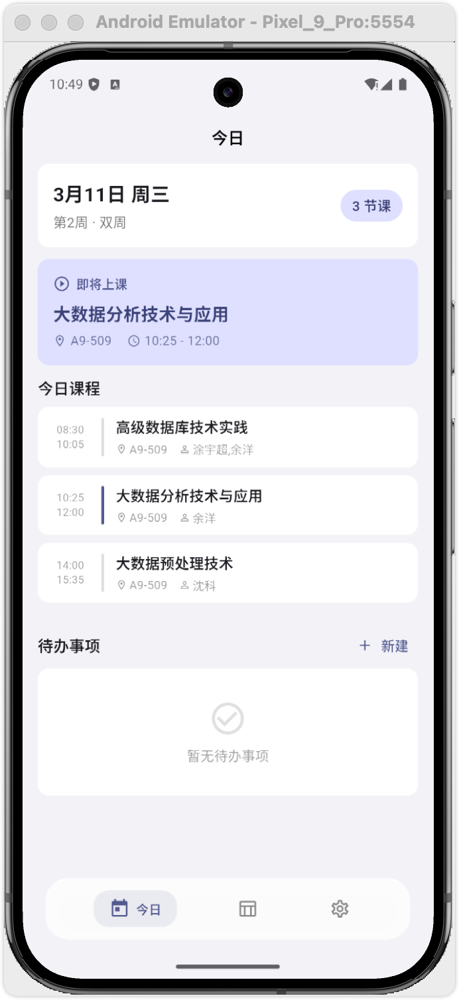
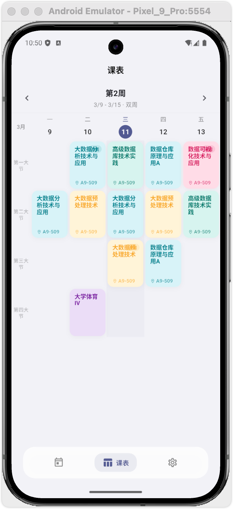

# 江软课

江西软件职业技术大学课表管理应用，支持导入教务系统导出的 `.xls` / `.xlsx` 课表文件，提供周视图、今日课程、任务管理和桌面小组件等功能。

## 功能特性

- **课表导入** — 支持解析教务系统导出的 `.xls` / `.xlsx` 文件，自动识别课程信息
- **周视图** — 5/7 天自适应课表网格，支持按周切换，高亮当天
- **今日概览** — 显示当前/下一节课程状态、今日课程列表和待办任务
- **任务管理** — 支持作业、考试、复习等类型，可设置优先级和截止时间，关联课程
- **桌面小组件** — Android 桌面/锁屏 Widget，显示当前课程和待办任务（iOS WidgetKit 支持）
- **学期设置** — 自定义学期开始日期，自动计算当前周数
- **数据管理** — 支持清空课程数据、重新导入，数据仅存储在本地
- **深色模式** — 跟随系统自动切换明暗主题
- **模板生成** — 可导出空白课表模板供手动填写

## 截图

<div style="width: 400px; display: flex; gap: 10px;">

<div style="width: 200px;">



</div>

<div style="width: 200px;">



</div>

</div>

## 技术栈

| 技术 | 版本 |
|---|---|
| Flutter | 3.41+ |
| Dart | 3.11+ |
| SQLite (sqflite) | 2.4+ |
| Material Design | 3 |

## 构建与运行

### 环境要求

- Flutter SDK 3.41+
- Dart SDK 3.11+
- Android SDK（Android 构建）
- Xcode 15+（iOS/macOS 构建）

### 运行

```bash
# 获取依赖
flutter pub get

# 运行调试版本
flutter run

# 构建 Android Release APK
flutter build apk --release

# 构建 Android App Bundle
flutter build appbundle --release

# 构建 iOS
flutter build ios --release
```

### 生成应用图标

替换 `assets/icon.png`（1024x1024 PNG）后执行：

```bash
dart run flutter_launcher_icons
```

## 许可证

本项目基于 [AGPL-3.0](LICENSE) 许可证开源。

Copyright (c) 2026 伍拾柒
